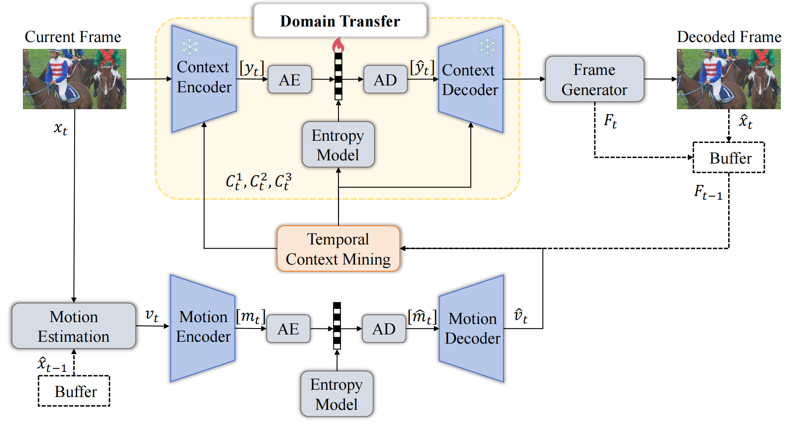
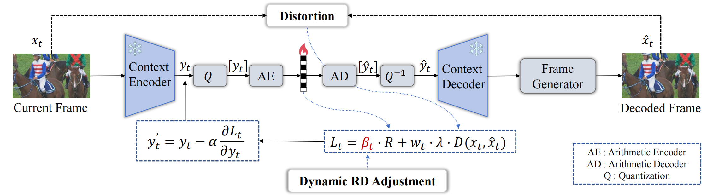
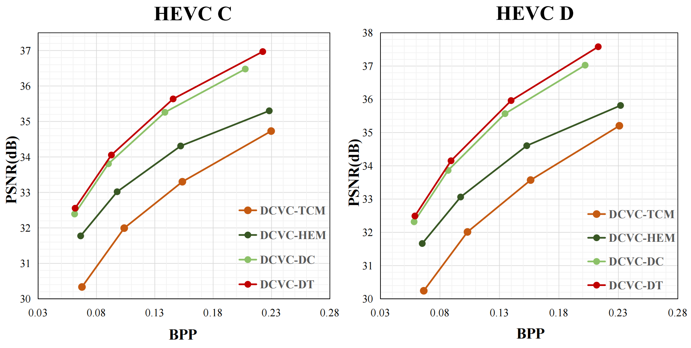
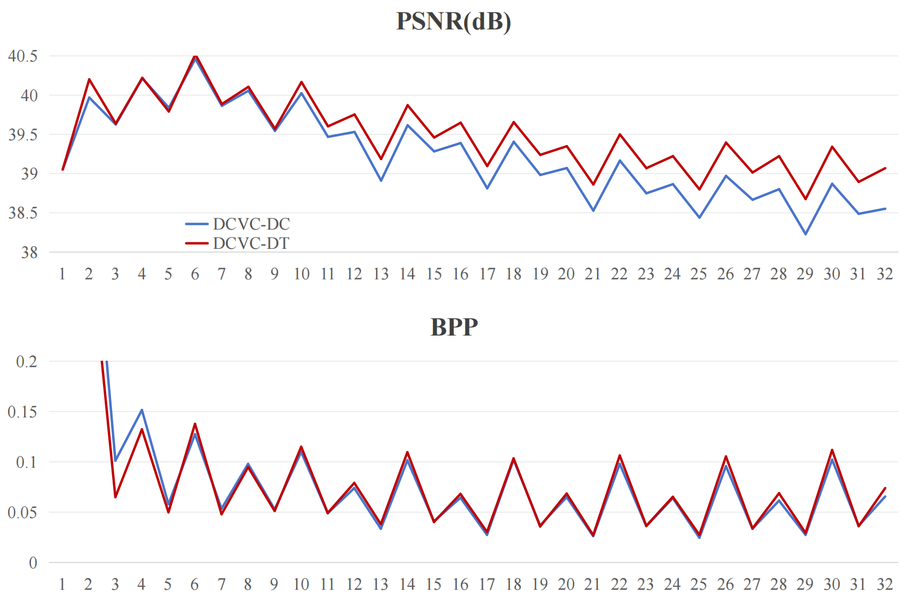
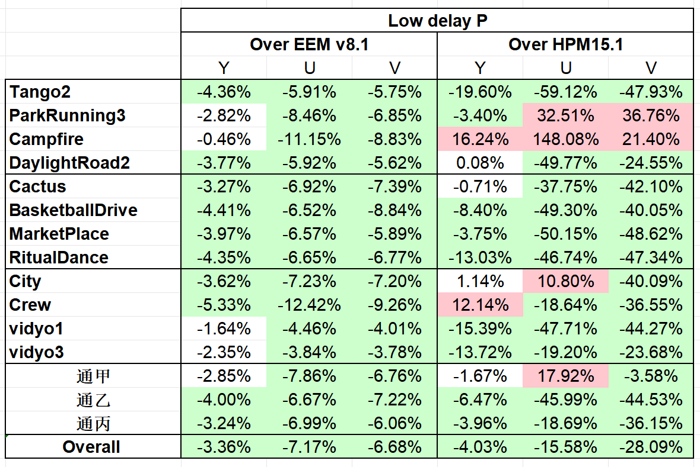

# DCVC-DT

Official code for the ISCAS 2026 paper *Neural Video Compression with Domain Transfer*.

Environment setup, dataset layout, optional C++ bitstream build, and **pretrained checkpoints** are the **same as [DCVC-DC](https://github.com/microsoft/DCVC/tree/main/DCVC-family/DCVC-DC)**: follow the upstream README, place checkpoints under `./checkpoints`, then use the commands below.

This repository adds **`test_video_y_latent_optimized.py`** only: copy it into the **DCVC-DC project root** (next to `test_video.py`).

# TODO
We will gradually open-source the project components in the following order:
- [ ] Release the binaries for HEVC **Class C and D**. (Note: You can directly use the DCVC-DC decoder to decode these bitstreams and compare the performance.)
- [ ] Release the binaries for HEVC **Class B** and other **1080p** sequences. (Note: You can directly use the DCVC-DC decoder to decode these bitstreams and compare the performance.)
- [ ] Release the **training code**.

## Introduction

Neural codecs are sensitive when test content differs from the training distribution; RD performance and generalization can suffer. DCVC-DT addresses this on top of the DCVC-DC backbone without retraining.

* **Online latent refinement.** Encoder and decoder **weights stay fixed**; only the **current-frame latent** is adapted at inference with lightweight gradient steps and stochastic Gumbel–annealing style quantization. Decoding cost is unchanged, while the encoder better fits the actual content.

* **Frame-level dynamic RD adjustment.** The objective balances rate and distortion; we **rescale the weight on the bitrate term** from frame to frame using **inter-frame PSNR fluctuation**, so bitrate is shifted where quality drops and overall RD improves.

The overall framework is illustrated below.

<div align="center">

</div>

The online refinement loop and the dynamic RD adjustment interact as sketched here.

<div align="center">

</div>

## Results

We follow DCVC-DC’s protocol on **HEVC Class C and D** under **PSNR** (BT.709). With **DCVC-DC as anchor**, DCVC-DT achieves about **6.21% average BD-rate reduction** over the eight sequences, and remains ahead of **DCVC-TCM** and **DCVC-HEM** in the same comparison.

**BD-rate (%) vs. DCVC-DC** (negative is better):

<div align="center">
<table>
<thead>
<tr>
<th nowrap align="center">Method</th>
<th align="center">BQMall</th>
<th align="center">BasketballDrill</th>
<th align="center">PartyScene</th>
<th align="center">RaceHorses</th>
<th align="center">BasketballPass</th>
<th align="center">BlowingBubbles</th>
<th align="center">BQSquare</th>
<th align="center">RaceHorses</th>
<th align="center"><strong>Avg</strong></th>
</tr>
</thead>
<tbody>
<tr>
<td nowrap align="center">DCVC-TCM</td>
<td align="center">103.99</td>
<td align="center">101.37</td>
<td align="center">107.23</td>
<td align="center">77.11</td>
<td align="center">82.13</td>
<td align="center">81.95</td>
<td align="center">140.53</td>
<td align="center">66.42</td>
<td align="center">95.09</td>
</tr>
<tr>
<td nowrap align="center">DCVC-HEM</td>
<td align="center">38.85</td>
<td align="center">54.14</td>
<td align="center">49.09</td>
<td align="center">30.81</td>
<td align="center">38.84</td>
<td align="center">40.71</td>
<td align="center">63.29</td>
<td align="center">33.70</td>
<td align="center">43.68</td>
</tr>
<tr>
<td nowrap align="center">DCVC-DC</td>
<td align="center">0.00</td>
<td align="center">0.00</td>
<td align="center">0.00</td>
<td align="center">0.00</td>
<td align="center">0.00</td>
<td align="center">0.00</td>
<td align="center">0.00</td>
<td align="center">0.00</td>
<td align="center">0.00</td>
</tr>
<tr>
<td nowrap align="center"><strong>DCVC-DT (Ours)</strong></td>
<td align="center"><strong>-7.95</strong></td>
<td align="center"><strong>-5.49</strong></td>
<td align="center"><strong>-3.22</strong></td>
<td align="center"><strong>-8.72</strong></td>
<td align="center"><strong>-5.64</strong></td>
<td align="center"><strong>-5.48</strong></td>
<td align="center"><strong>-5.91</strong></td>
<td align="center"><strong>-7.25</strong></td>
<td align="center"><strong>-6.21</strong></td>
</tr>
</tbody>
</table>
</div>

R–D curves (same setting):

<div align="center">

</div>

Where **error propagation** is visible, reconstruction and bitrate use tend to be **smoother across frames**. On **BasketballPass** (Class D, first 32 frames at the highest rate), PSNR and BPP evolve more favorably than the baseline.

<div align="center">

</div>

## AVS-EEM Integration Performance:

AVS-EEM (AVS End-to-End Intelligent Video Coding Exploration Model) is a standardization project launched by the AVS video coding working group, aimed at designing and exploring deployable end-to-end intelligent video coding systems under strict computational complexity constraints. 

Our online learning enhancement technique has also been proposed and evaluated as an optional encoder-side configuration within the AVS-EEM platform. By integrating Stochastic Gumbel Annealing (SGA-Q), optimizing the YUV Loss ratio to 1:1:1 to prevent chroma degradation, and utilizing frame-level dynamic RD adjustments, the encoder adapts effectively to test sequence characteristics. Operating strictly as a pure encoder-side optimization, this approach guarantees zero additional overhead to the decoding time. When benchmarked against the EEM v8.1 platform, our method achieves comprehensive rate-distortion performance gains of **-3.36% (Y)**, **-7.17% (U)**, and **-6.68% (V)**.

<div align="center">

</div>

## Pretrained models

Identical to **DCVC-DC**: download the official pretrained models into `./checkpoints`, or use the download script in that folder.

## Test the models

Before running the evaluation, please ensure that you have completed the environment setup according to the **Prerequisites** section of **[DCVC-DC](https://github.com/microsoft/DCVC/tree/main/DCVC-family/DCVC-DC)** and organized your test sequences in **RGB format** (PNG files) as described in their **Test dataset** guidelines.

To test the pretrained model with four rate points (using RGB data organization), first copy the `test_video_y_latent_optimized.py` file into the DCVC-DC project root directory, then run the following command:

```text
python test_video_y_latent_optimized.py --i_frame_model_path ./checkpoints/cvpr2023_image_psnr.pth.tar --p_frame_model_path ./checkpoints/cvpr2023_video_psnr.pth.tar --rate_num 4 --test_config ./dataset_config_example_rgb.json --yuv420 0 --cuda 1 --cuda_device 0,1,2,3 --worker 4 --write_stream 1 --stream_path ./stream --save_decoded_frame 1 --decoded_frame_path ./decoded_frames --output_path output.json --force_intra_period 32 --force_frame_num 96
```

## Acknowledgement

The implementation is based on **[DCVC-DC](https://github.com/microsoft/DCVC/tree/main/DCVC-family/DCVC-DC)** (Microsoft), **[CompressAI](https://github.com/InterDigitalInc/CompressAI)**, and **[PyTorchVideoCompression](https://github.com/Zhengxuezhao/PyTorchVideoCompression)**.

## Citation

If you find this work useful for your research, please cite our ISCAS paper (or arXiv) and the DCVC-DC reference:

```bibtex
@inproceedings{li2023neural,
  title     = {Neural Video Compression with Diverse Contexts},
  author    = {Li, Jiahao and Li, Bin and Lu, Yan},
  booktitle = {{IEEE/CVF} Conference on Computer Vision and Pattern Recognition,
               {CVPR} 2023, Vancouver, Canada, June 18--22, 2023},
  year      = {2023}
}

@misc{zhang2026neuralvideocompressiondomain,
      title={Neural Video Compression with Domain Transfer}, 
      author={Tiange Zhang and Rongqun Lin and Xiandong Meng and Haofeng Wang and Xing Tian and Qi Zhang and Siwei Ma},
      year={2026},
      eprint={2605.13476},
      archivePrefix={arXiv},
      primaryClass={cs.CV},
      url={https://arxiv.org/abs/2605.13476}, 
}
```
